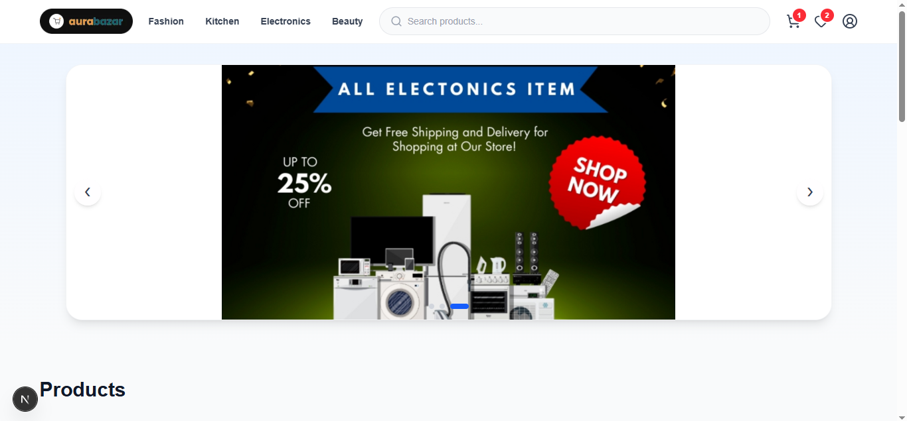
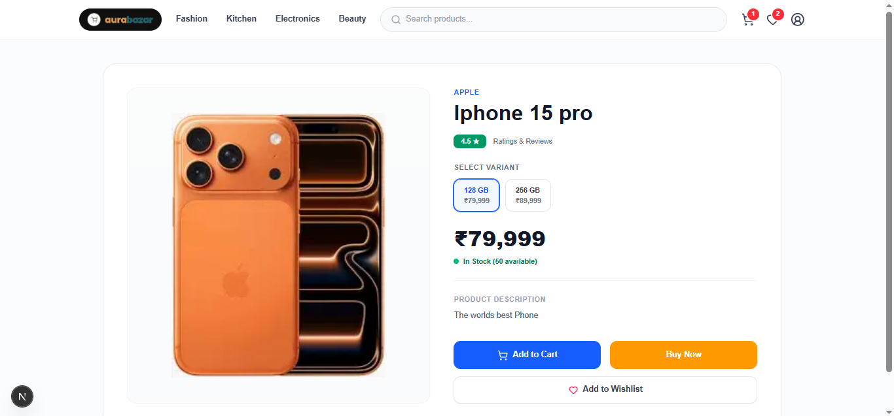
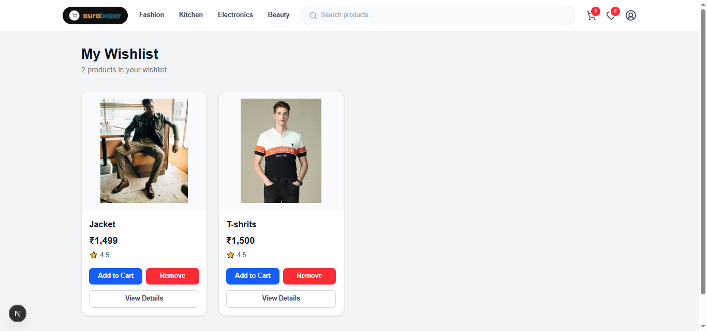
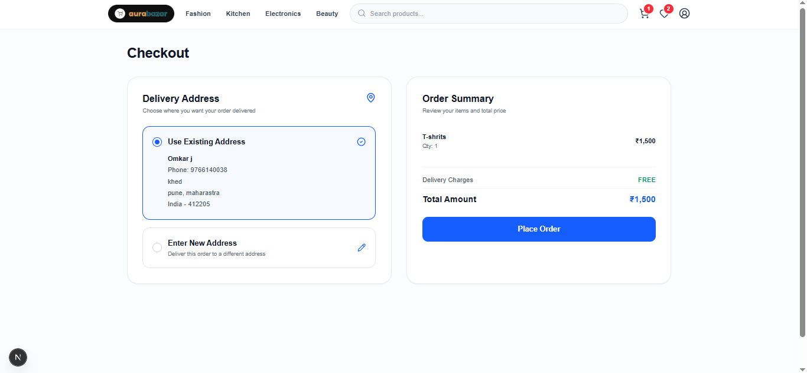
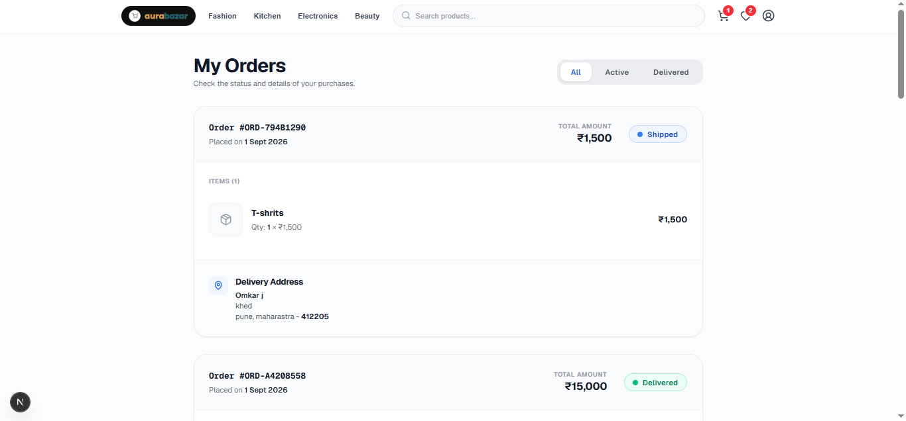
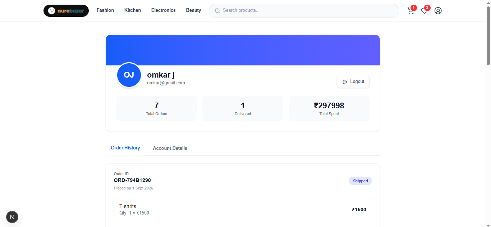
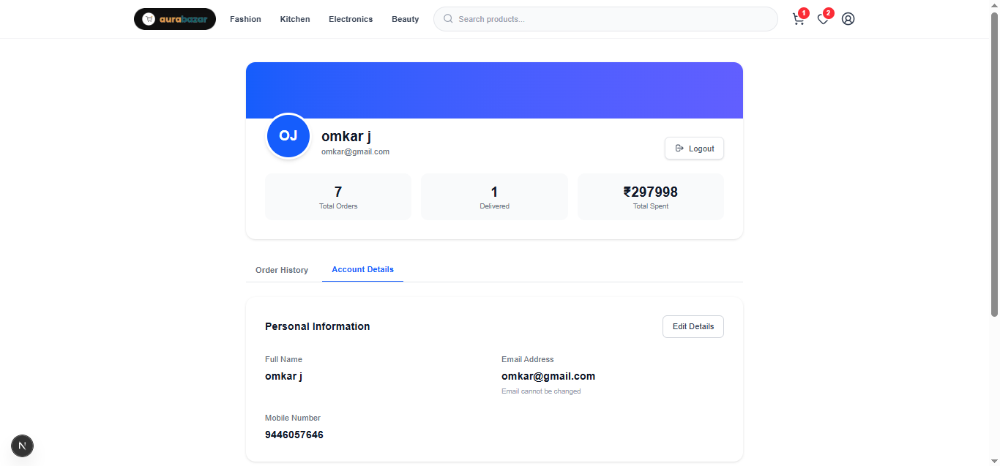
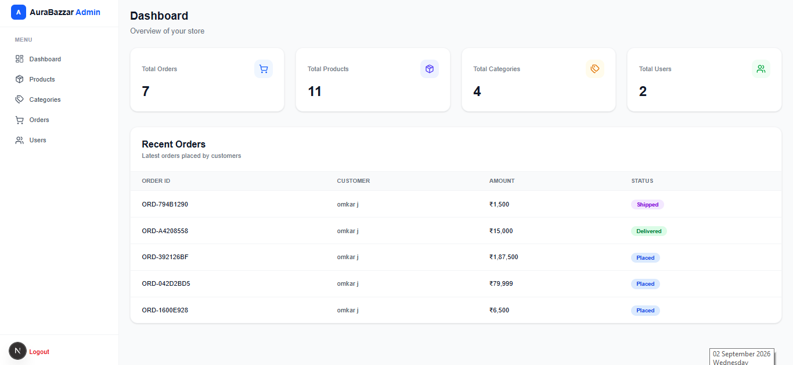
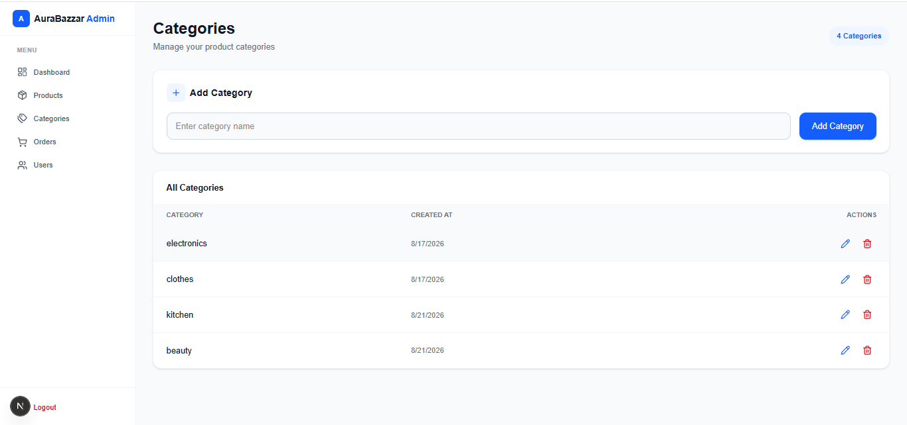
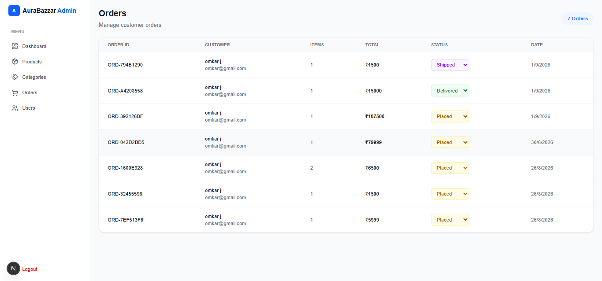

# 🛒 Full-Stack E-Commerce Platform

A modern **full-stack e-commerce web application** inspired by platforms such as Flipkart. The project provides a complete shopping experience for users along with a dedicated **Admin Panel** for managing products, categories, orders, and the overall store.

The application is built using **Next.js, FastAPI, MongoDB, and Tailwind CSS**, with JWT-based authentication and REST APIs connecting the frontend and backend.

---

## 📌 Project Overview

This project is designed to simulate a real-world e-commerce platform where users can:

* Create an account and log in
* Browse products
* Search and filter products
* View detailed product information
* Select product variants
* Add products to cart
* Add products to wishlist
* Buy products directly
* Place orders
* Track order status
* Manage their profile and address

The application also includes an **Admin Panel** where administrators can:

* Manage products
* Manage product variants
* Manage categories
* View all customer orders
* Update order status
* View dashboard statistics

---

# ✨ Features

## 👤 User Features

### 🔐 Authentication

* User registration
* User login
* JWT-based authentication
* Protected user routes
* User profile management
* Address management

### 🛍️ Product Browsing

* View all products
* View products by category
* Search products
* Product detail page
* Product images
* Product ratings and reviews information
* Product stock information

### 🎨 Product Variants

Products can have multiple variants such as:

* Size
* Color
* Storage
* Other custom attributes

Each variant can have its own:

* Price
* Stock
* Variant UUID

### 🛒 Shopping Cart

Users can:

* Add products to cart
* Select product variants
* Increase/decrease quantity
* Remove products
* View cart total
* Checkout cart items

### ❤️ Wishlist

Users can:

* Add products to wishlist
* Add specific product variants
* Remove products from wishlist
* Move wishlist products to cart

### ⚡ Buy Now

Users can directly purchase a product without adding it to the cart first.

### 📦 Orders

Users can:

* Place orders
* View previous orders
* View order details
* Track order status

Example order statuses:

```text
Pending
Processing
Shipped
Delivered
Cancelled
```

### 👤 Profile

Users can manage:

* Name
* Email
* Phone number
* Address
* Personal information
* Order history

---

# 🛡️ Admin Features

The project includes a separate Admin Panel for store management.

## 📊 Admin Dashboard

The dashboard provides an overview of the store, including:

* Total products
* Total categories
* Total orders
* Order information
* Store statistics

## 📦 Product Management

Admins can:

* Create products
* Update products
* Delete products
* Add product images
* Manage stock
* Manage prices
* Add product variants
* Update variant prices
* Update variant stock

## 🗂️ Category Management

Admins can:

* Create categories
* View categories
* Update categories
* Delete categories

## 🚚 Order Management

Admins can:

* View all customer orders
* View order details
* Check customer information
* Check purchased products
* Update order status

---

# 🏗️ Technology Stack

## Frontend

| Technology   | Purpose            |
| ------------ | ------------------ |
| Next.js      | Frontend framework |
| React        | UI development     |
| Tailwind CSS | Styling            |
| JavaScript   | Application logic  |
| Lucide React | Icons              |

## Backend

| Technology | Purpose             |
| ---------- | ------------------- |
| Python     | Backend programming |
| FastAPI    | REST API framework  |
| Pydantic   | Data validation     |
| JWT        | Authentication      |
| PyMongo    | MongoDB interaction |

## Database

| Technology    | Purpose        |
| ------------- | -------------- |
| MongoDB Atlas | Cloud database |
| MongoDB       | Data storage   |

## Development Tools

* Git
* GitHub
* VS Code
* Postman

---

# 🏛️ Project Architecture

```text
                    ┌─────────────────────┐
                    │       User          │
                    └──────────┬──────────┘
                               │
                               ▼
                    ┌─────────────────────┐
                    │     Next.js         │
                    │     Frontend        │
                    └──────────┬──────────┘
                               │
                         REST API
                               │
                               ▼
                    ┌─────────────────────┐
                    │      FastAPI        │
                    │       Backend       │
                    └──────────┬──────────┘
                               │
                               ▼
                    ┌─────────────────────┐
                    │     MongoDB Atlas   │
                    │      Database       │
                    └─────────────────────┘
```

---

# 🔑 Authentication Flow

The application uses **JWT authentication**.

```text
User
  │
  │ Login
  ▼
Next.js Frontend
  │
  │ POST /auth/login
  ▼
FastAPI Backend
  │
  │ Validate credentials
  ▼
MongoDB
  │
  │ User found
  ▼
FastAPI
  │
  │ Generate JWT
  ▼
Next.js
  │
  │ Store token
  ▼
Authenticated User
```

The JWT contains information such as:

```text
userUuid
email
role
```

The token is then sent with protected API requests using the `Authorization` header.

---

# 🆔 UUID-Based Architecture

The application uses MongoDB's internal `_id` while also maintaining public UUIDs for application-level entities.

Examples:

```text
userUuid
categoryUuid
productUuid
variantUuid
cartUuid
wishlistUuid
orderUuid
```

This provides a clean separation between the internal MongoDB identifier and the identifiers exposed through the application's APIs.

---

# 🔌 API Endpoints

## Authentication

```text
POST /auth/register
POST /auth/login
GET  /me
```

## Products

```text
GET  /products
GET  /products/{productUuid}
POST /admin/products
```

## Cart

```text
POST   /cart
GET    /cart
PUT    /cart/{productUuid}
DELETE /cart/{productUuid}
```

## Wishlist

```text
POST   /wishlist
GET    /wishlist
DELETE /wishlist/{productUuid}
```

## Orders

```text
POST /orders
GET  /orders
GET  /admin/orders
PUT  /admin/orders/{orderUuid}/status
```

## Categories

```text
POST   /admin/categories
GET    /admin/categories
PUT    /admin/categories/{categoryUuid}
DELETE /admin/categories/{categoryUuid}
```

## Admin Dashboard

```text
GET /admin/dashboard
```

---

# 📸 Screenshots

## 👤 User Side

### 🏠 Home Page





### 🛍️ Product Listing


### 📦 Product Details

*Add your product details screenshot here.*





### 🛒 Shopping Cart


### ❤️ Wishlist





### 💳 Checkout





### 📦 Orders





### 👤 User Profile






---

# 🛡️ Admin Side

## 📊 Admin Dashboard





## 📦 Product Management


## 🗂️ Category Management





## 🚚 Order Management





---

# 📁 Project Structure

```text
ecommerce/
│
├── frontend/
│   ├── app/
│   ├── components/
│   ├── public/
│   ├── styles/
│   ├── package.json
│   └── ...
│
├── backend/
│   ├── main.py
│   ├── models/
│   ├── schemas/
│   ├── routes/
│   ├── services/
│   ├── database/
│   ├── requirements.txt
│   └── ...
│
├── screenshots/
│   ├── user-home.png
│   ├── products.png
│   ├── product-details.png
│   ├── cart.png
│   ├── wishlist.png
│   ├── checkout.png
│   ├── orders.png
│   ├── profile.png
│   ├── admin-dashboard.png
│   ├── admin-products.png
│   ├── admin-categories.png
│   └── admin-orders.png
│
└── README.md
```

---

# ⚙️ Installation & Setup

## 1. Clone the Repository

```bash
git clone <your-github-repository-url>
```

```bash
cd ecommerce
```

---

## 2. Backend Setup

Navigate to the backend directory:

```bash
cd backend
```

Create a virtual environment:

```bash
python -m venv venv
```

Activate the environment.

### Windows

```bash
venv\Scripts\activate
```

Install dependencies:

```bash
pip install -r requirements.txt
```

Start the FastAPI server:

```bash
uvicorn main:app --reload
```

The backend will run on:

```text
http://localhost:8000
```

---

# 🌐 Frontend Setup

Navigate to the frontend:

```bash
cd frontend
```

Install dependencies:

```bash
npm install
```

Start the development server:

```bash
npm run dev
```

The frontend will run on:

```text
http://localhost:3000
```

---

# 🔐 Environment Variables

Create a `.env` file in the backend and configure your environment variables.

Example:

```env
MONGODB_URI=your_mongodb_connection_string
DATABASE_NAME=your_database_name
JWT_SECRET=your_secret_key
```

Do not commit your `.env` file to GitHub.

Add it to `.gitignore`:

```text
.env
venv/
node_modules/
__pycache__/
```

---

# 🔄 Application Flow

A typical shopping flow works like this:

```text
Register / Login
       ↓
Browse Products
       ↓
Select Product
       ↓
Select Variant
       ↓
Add to Cart / Buy Now
       ↓
Checkout
       ↓
Create Order
       ↓
Stock Updated
       ↓
Order Created
       ↓
Admin Processes Order
       ↓
Order Status Updated
       ↓
User Views Order Status
```

---

# 💡 Key Learning Outcomes

This project helped demonstrate practical experience with:

* Full-stack web application development
* REST API development
* FastAPI
* Next.js
* React
* MongoDB
* CRUD operations
* JWT authentication
* Role-based authorization
* Pydantic validation
* Product variants
* Shopping cart architecture
* Wishlist functionality
* Order management
* Database design
* API integration
* Frontend state management
* Responsive UI development
* Git and GitHub

---

# 🚀 Future Improvements

Possible future enhancements include:

* Online payment integration
* Product reviews and ratings
* Coupon and discount system
* Advanced product filtering
* Pagination
* Email notifications
* Order tracking
* Product recommendations
* Analytics dashboard
* Inventory management
* Cloud image storage
* Deployment using cloud platforms

---

# 👨‍💻 Author

**Varun Konde**

Full-Stack Developer | Data & Technology Enthusiast

### Technologies

```text
Python • FastAPI • Next.js • React • MongoDB
JavaScript • Tailwind CSS • SQL • Git • GitHub
```

---

# ⭐ Project

If you find this project useful or interesting, consider giving the repository a ⭐ on GitHub.

---
